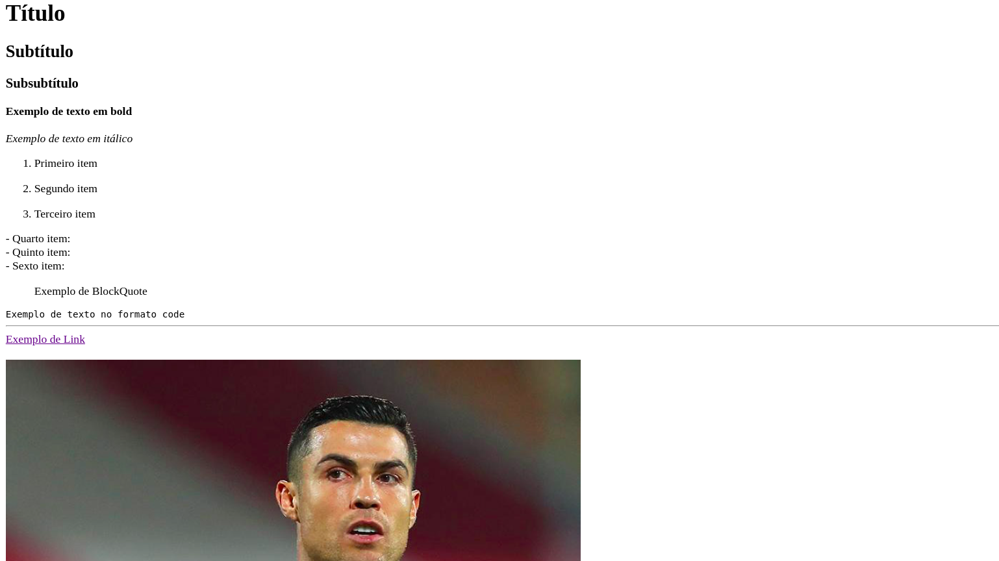

# PL2024

## Autor

**Nome:** Henrique Morais Pereira

**ID:** A100831

### Enunciado:

Este TPC consistia em criar em Python um pequeno conversor de MarkDown para HTML para os elementos descritos na "Basic Syntax" da Cheat Sheet.

### Resolução:

Começo por dar import do módulo "re" para utilizar expressões regulares.

A main chama a função read_md que lê um arquivo Markdown através do caminho fornecido e converte cada linha de Markdown para HTML usando a função md_to_html que é onde a maior a conversão acontece. Ela recebe uma string em Markdown e usa várias expressões regulares para substituir a sintaxe de Markdown pela sintaxe correspondente em HTML. Faz isso para os cabeçalhos, negrito, itálico, listas ordenadas e não ordenadas, citações, código, regras horizontais, links e imagens.

A função write_html recebe uma lista de linhas HTML e escreve num ficheiro HTML com a estrutura básica de um documento HTML.

### Resultados:

