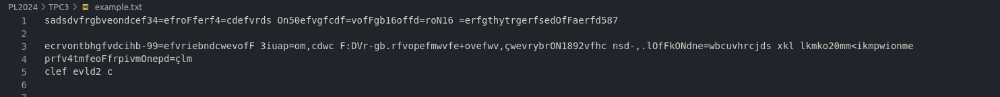
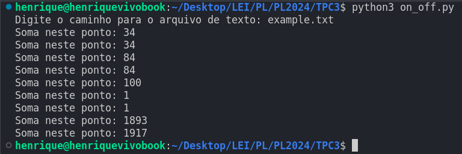

# PL2024

## TPC3

**Nome:** Henrique Morais Pereira

**ID:** A100831

### Enunciado:

Somador on/off: criar o programa em Python
1. Pretende-se um programa que some todas as sequências de dígitos que encontre num texto;
2. Sempre que encontrar a string “Off” em qualquer combinação de maiúsculas e minúsculas, esse comportamento é desligado;
3. Sempre que encontrar a string “On” em qualquer combinação de maiúsculas e minúsculas, esse comportamento é novamente ligado;
4. Sempre que encontrar o caráter “=”, o resultado da soma é colocado na saída.

### Resolução:
A função somador examina o arquivo linha por linha. Caso encontre a palavra "on", muda para um estado de ativação de contagem, se encontrar "off" começa a contagem daí em diante.  A cada ocorrência do caracter "=", imprime a soma atual até aquele ponto. Também funciona com números negativos subtraindo da soma o seu valor. Para encontrar os caracteres importantes utilizamos uma expressão regular que analisa se é um on, off ou "=" bem como os elementos numércos para a soma.
### Resultados:
Usando este ficheiro como exemplo para o teste do programa, deverá devolver: 34, 34, 84, 84, 100, 1, 1, 1893, 1917

Como podemos observer na seguinte imagem que demontra o output, o programa funciona como o esperado

