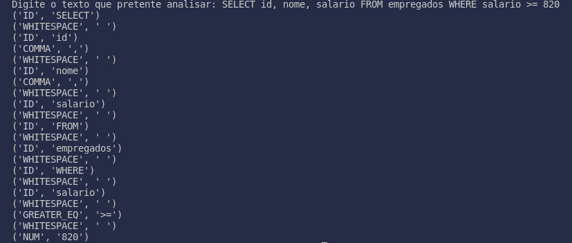

# PL2024

## TPC4

**Nome:** Henrique Morais Pereira

**ID:** A100831

### Enunciado:

Construir um analisador léxico para uma liguagem de query com a qual se podem escrever frases do género:
Select id, nome, salario From empregados Where salario >= 820

### Resolução:
No código foi implementada a função lexer que solicita um texto para análise. Foram definidos padrões de expressões regulare para os diferentes tipos de tokens, como palavras-chave, identificadores e números, por exemplo, ('SELECT', r'select') indica que o token "SELECT" será reconhecido quando a palavra "select" for encontrada no texto. De seguida, utiliza-se esses padrões para encontrar correspondências no texto fornecido pelo usuário, percorrendo o texto através da função re.finditer(). Ela identifica os tokens correspondentes no texto usando as expressões regulares definidas anteriormente, armazenando os tokens encontrados numa lista. Por fim, os tokens são impressos no terminal, mostrando os seus tipos e valores correspondentes.

### Resultados:

Como podemos observer na seguinte imagem que demontra o output, o programa funciona como o esperado

