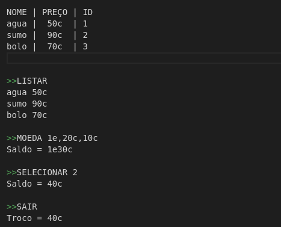

# PL2024

## TPC5

**Nome:** Henrique Morais Pereira

**ID:** A100831

### Enunciado:
Construir um analisador léxico e gramatical em python que funcione como uma vending machine que carregue uma lista de produtos com nome, preço e um id.
A imagem exemplo abaixo demonstra uma lista e os seguintes os comandos que se pretendem implementar:

### Resolução:
Começou-se com a definição de uma lista de produtos, onde cada produto é representado como um dicionário contendo o nome, preço e id do produto.

Definiu-se uma lista de tokens, que são usados para analisar o input do utilizador. A função analisador_lexico utilizaa expressões regulares para comparar o input do utilizador com um dos tokens definidos. Se o input do utilizador corresponder a um dos tokens, a função retorna o tipo do token e quaisquer argumentos associados.

A função analisador_gramatical é usada para interpretar o tipo e os argumentos retornados pelo analisador_lexico. Ela retorna um comando que é usado posteriormente para determinar a ação a ser tomada. Por exemplo, se o tipo for “LISTAR”, a função retorna o comando “listar”. Se o tipo for “MOEDA”, a função retorna o comando “moeda” e uma lista de moedas inseridas pelo utilizador.

A função saldo calcula o saldo total das moedas inseridas pelo utilizador. A função display_saldo é usada para formatar o saldo para exibição. Se o saldo for maior ou igual a 100, ele é exibido em euros e cênctimos. Se for menor que 100, é exibido apenas em cêntimos.

A função comprar tenta comprar um produto com o saldo atual. Se o saldo for suficiente, o produto é comprado e o troco é calculado. Se o saldo não for suficiente, a função levanta uma exceção.

A função listar é usada para listar todos os produtos disponíveis para compra. Para cada produto, ela exibe o id do produto, o nome e o preço.

A main lê o input do utilizador, analisa-o e executa o comando correspondente. O loop continua até que o comando “SAIR” seja recebido. Quando o comando “SAIR” é recebido, o programa exibe o troco restante e exibe uma mensagem de adeus.

### Resultados:

Como podemos observer na seguinte imagem que demontra o output, o programa funciona como o esperado

